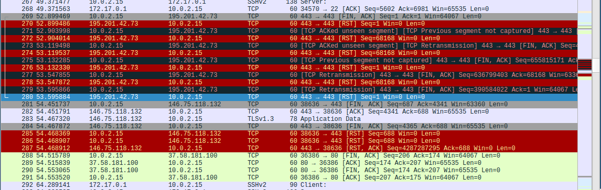

# Memory Forensics / Exercises
Questions and answers for the problems that we provide during the
workshop.

Disclaimer: Since the workshop time is limited, and we don't really
have a good idea about the audience that we're going to address,
most exercises are designed to be short and simple.
They can be solved with basic
command line tools like `strings`, `grep`, `binwalk`, `readelf`,
`bpftool`, `ebpfkit-monitor`, etc., or by running Volatility plugins.
Some require a little bit of coding in Python.
In particular, we do not use any special obfuscation or anti-forensics
techniques, we use only 'perfect' dumps acquired via a VMM, the dumped
systems are pretty boring, the "malware" simple,
and we include lots of useful strings. In short, the exercises are not
meant to be realistic.

Remarks:
- there are many ways to solve each exercise, so don't be surprised if
yours is no the one described here
- commands are either prefixed with a "$" or a "#". The former ones are
meant to be executed inside the Volatility3 Docker container,
while the latter ones are intended to be executed directly in the VM.

## Unstructured Memory Analysis / Kernel: Configuration and Version / Three Kernels
- dump: `34a6275f5de2120620cd2457b3f48c8d.elf`
- dump: `3b2e42cfa934f302a02334c6dbd771cf.elf`
- dump: `ffc6f879f23b6b80b6fec6eea951491e.elf`
- commands:
We start with a somewhat old Arch Linux kernel. It must have been
released shortly after the introduction of BTF.
```
# vol -f /io/dumps/34a6275f5de2120620cd2457b3f48c8d.elf banners.Banners
...
0x186000e0      Linux version 4.18.8-arch1-1-ARCH (builduser@heftig-15200) (gcc version 8.2.1 20180831 (GCC)) #1 SMP PREEMPT Sat Sep 15 20:34:48 UTC 2018
```
Secondly, we have one of the custom kernels that we use for the
workshop.
```
# vol -f /io/dumps/3b2e42cfa934f302a02334c6dbd771cf.elf banners.Banners
...
0x24000c0       Linux version 6.0.12 (user@d799c7b011ae) (Ubuntu clang version 14.0.0-1ubuntu1, Ubuntu LLD 14.0.0) #1 SMP PREEMPT_DYNAMIC Wed Feb 22 09:00:24 UTC 2023
```
The last dump is from the most ancient kernel that I could find in my
VitualBox. There's no BPF in here, that's for sure.

```
# vol -f /io/dumps/ffc6f879f23b6b80b6fec6eea951491e.elf banners.Banners
...
0x155f080       Linux version 3.0.0-13-generic-pae (buildd@rothera) (gcc version 4.6.1 (Ubuntu/Linaro 4.6.1-9ubuntu3) ) #22-Ubuntu SMP Wed Nov 2 15:17:35 UTC 2011 (Ubuntu 3.0.0-13.22-generic-pae 3.0.6)
```
To get the kernel config from the dump, we can use the
`extract-ikconfig` script (or just binwalk). In order for this to work,
`CONFIG_IKCONFIG=y` must be set.

The Arch kernel has support for BPF classifier programs attached to
network interfaces (as an LKM).

```
$ /opt/workshop/memory_forensics/materials/extract-ikconfig \
io/dumps/34a6275f5de2120620cd2457b3f48c8d.elf | rg NET_CLS
...
CONFIG_NET_CLS_BPF=m
...
CONFIG_NET_CLS_ACT=y
```
The custom kernel also supports it.
```
$ /opt/workshop/memory_forensics/materials/extract-ikconfig \
io/dumps/3b2e42cfa934f302a02334c6dbd771cf.elf | rg NET_CLS
...
1210:CONFIG_NET_CLS_BPF=y
...
1221:CONFIG_NET_CLS_ACT=y
```
The old Arch kernel does not support overwriting return values with BPF
(a current Arch kernel has this enabled).
```
$ /opt/workshop/memory_forensics/materials/extract-ikconfig \
io/dumps/34a6275f5de2120620cd2457b3f48c8d.elf | rg BPF_KPROBE_OVERRIDE
# CONFIG_BPF_KPROBE_OVERRIDE is not set
```
The custom kernel also does not support it (The error injection
framework is a prerequisite).
```
$ /opt/workshop/memory_forensics/materials/extract-ikconfig \
io/dumps/3b2e42cfa934f302a02334c6dbd771cf.elf | rg ERROR
...
5056:# CONFIG_FUNCTION_ERROR_INJECTION is not set
```

## Unstructured Memory Analysis / File Carving and Analysis / Embedded + Compressed
- dump: `ebpfkit-monitor_not-running_cleanfs-8733ce65-d799c7b011ae.elf`=
`9c21137cb5af75a621ff657b9b7a3fb7.elf`
- commands:
The first two exercises can be solved with:
```
$ cd io/dumps && 7z x 9c21137cb5af75a621ff657b9b7a3fb7.7z
$ binwalk --dd='zip:.gzip' -j 0x20000 -y 'zip' --directory /tmp 9c21137cb5af75a621ff657b9b7a3fb7.elf
$ pushd /tmp/_9c21137cb5af75a621ff657b9b7a3fb7.elf.extracted && file *
...
AF36998:      ELF 64-bit LSB relocatable, eBPF, version 1 (SYSV), can't read elf section at 30688
AF36998.gzip: gzip compressed data, original size modulo 2^32 1984796990 gzip compressed data, unknown method, has CRC, extra field, has comment, encrypted, from FAT filesystem (MS-DOS, OS/2, NT), original size modulo 2^32 1984796990
...
$ gunzip AF36998.gzip -c > tmp.bpf.o
$ ebpfkit-monitor graph -a tmp.bpf.o
$ xdot -f fdp /tmp/ebpfkit-monitor-graph-1800799144 # make sure X is running (GUI)
$ popd
```
Notes:
- I decompressed the carved zip file myself, as the file that was
decompressed by binwalk was broken.
- It is possible to perfectly recover the embedded ELF file.


For a more detailed analysis we can also open the file up in Ghidra.


To find out which program we are looking at, we can check the `strings`
of `tmp.bpf.o` and try to find something "unique", e.g.
[tgid_cookie](https://grep.app/search?q=maps/tgid_cookie`). Using
a code search engine we can identify the software.

The fact that there is no decompressed BPF ELF is an indicator that the
software was not actually running.
```
$ yara /opt/workshop/memory_forensics/materials/yara_rule_BpfElf 9c21137cb5af75a621ff657b9b7a3fb7.elf
```
There would be a match if it were (or was recently) running, since then
the process would have decompressed the archive.

## Structured Memory Analysis / tl;dr Volatility3 / BPF Powered `LD_PRELOAD` Rootkit
- dump: `azazel+envd_systemd-unit_libv-8733ce65-d799c7b011ae.elf`=
`779e2ce7cc0ccae477896b800825ccc4.elf`
- commands:
Each and every process, besides `systemd` and `systemd-journal`,
has `libv.so` mapped.
```
# vol -f /io/dumps/779e2ce7cc0ccae477896b800825ccc4.elf linux.elfs
...
246     sshd    0x7f1923694000  0x7f1923696000  /usr/usr/lib/usr/lib/x86_64-linux-gnu/usr/lib/x86_64-linux-gnu/libv.so
...
```
Furthermore, `kmsg` recorded that a systemd unit that loads a BPF
program was active at startup.
```
# vol -f /io/dumps/779e2ce7cc0ccae477896b800825ccc4.elf linux.kmsg
...
daemonssinfo00.04.960816        Task(1)gsystemd[1]: Starting envd.service - manages system environment...
kern    warn    5.304055        Task(118)       envd[118] is installing a program with bpf_probe_write_user helper that may corrupt user memory!
...
daemon  info    5.482856        Task(1) systemd[1]: envd.service: Deactivated successfully.
daemon  info    5.485860        Task(1) systemd[1]: Finished envd.service - manages system environment.
```
BPFfs is mounted:
```
# vol -f /io/dumps/779e2ce7cc0ccae477896b800825ccc4.elf linux.mountinfo
...
4026532179	69	67	0:23	/	/sys/fs/bpf	rw,nosuid,nodev,noexec,relatime	shared:34 master:8	bpf	bpf	rw
...
```
Passing the mount ID to the `linux.files` plugin shows us the pinned
program.
```
# vol -f /io/dumps/779e2ce7cc0ccae477896b800825ccc4.elf linux.files --mount 69
Volatility 3 Framework 2.4.1
Progress:  100.00               Stacking attempts finished
Mount ID        Inode ID        Inode Address   Mode    UID     GID     Size    Created Modified        Accessed        File Path

26      1       0x888005951c80  drwx-----T      0       0       0       1677416402      1677416402      1677416448      /sys/fs/bpf
26      1151    0x888005952140  -r--------      0       0       0       1677416399      1677416399      1677416399      /sys/fs/bpf/progs.debug
26      134     0x8880044c3440  -rw-------      0       0       0       1677416402      1677416402      1677416402      /sys/fs/bpf/envd
26      1150    0x888005951ee0  -r--------      0       0       0       1677416399      1677416399      1677416399      /sys/fs/bpf/maps.debug
```
If you see an error message, run `xchg_sym_init` in the container. We should check if we can simply carve the library from the dump:

```
$ binwalk --dd='elf:.elf' -j 0x20000 -y 'elf' --directory /tmp io/dumps/779e2ce7cc0ccae477896b800825ccc4.elf
$ pushd /tmp/_779e2ce7cc0ccae477896b800825ccc4.elf.extracted
$ readelf -d * 2>/dev/null | rg soname
```
Ok, that does not work but there are
[Awesome Lists](https://github.com/milabs/awesome-linux-rootkits/blob/master/README.md)
for everything, simply try some names:
```
$ for file in $(ls); do; echo $file && strings $file | rg Azazel; done
```
Nice, that at least gives us some hints which files might be
interesting.
Unfortunately, we probably won't be able to carve a perfect copy of the
lib from the dump.
We could try to use Volatility to reconstruct the address space, if the
kernel actually bothered loading the object into memory.
Finally, creds to Avast and AVG for confirming it is Azazel when
uploading the carved ELF to VT:
```
https://www.virustotal.com/gui/file/cabc06958a8917b858fa9449d7361b3da0d3f21e6e1d94f9e33850c20922b996?nocache=1
```
We know that `envd` exited:
```
# vol -f /io/dumps/779e2ce7cc0ccae477896b800825ccc4.elf linux.pslist | rg envd
```
Nevertheless, we can still find its binary and carve the BPF ELF file
(it is not well-formatted though)

```
$ yara /opt/workshop/memory_forensics/materials/yara_rule_EmbeddedBpfElf .
EmbeddedBpfElf ./7525E18.elf
$ binwalk -D 'elf:.bpf.o' --magic /opt/workshop/memory_forensics/materials/binwalk_signature_BpfElf 7525E18.elf
```
`strings` should have enough info to find out how the `envd` program
works.
```
$ strings _7525E18.elf.extracted/15048.bpf.o | rg 'write_user'
  if (bpf_probe_write_user((void*)env, "LD_PRELOAD=libv.so\0", 19)) {
      if (bpf_probe_write_user((void*)(auxv + 8), &zero, 8) < 0) {
```
Remembering our earlier findings, we can conclude that the
corresponding systemd unit is responsible for reinfection on reboots.
We can even get the unit file for free
```
$ strings /io/dumps/779e2ce7cc0ccae477896b800825ccc4.elf | rg '=/sbin/envd' -C 10
...
[Unit]
DefaultDependencies=no
Description=manages system environment
Before=local-fs.target
[Service]
Type=oneshot
ExecStart=/sbin/envd
TimeoutSec=0
RemainAfterExit=no
[Install]
RequiredBy=local-fs.target
```

## Structured Memory Analysis / BPF for Volatility3 / BPF powered `LD_PRELOAD` rootkit
- dump: `azazel+envd_systemd-unit_libv-8733ce65-d799c7b011ae.elf`=
`779e2ce7cc0ccae477896b800825ccc4.elf`
- commands:

The first question can be solved by inspecting the output of the
`bpf_graph`, `bpf_listprogs`, and `bpf_listmaps` plugins.

```
# vol -f /io/dumps/779e2ce7cc0ccae477896b800825ccc4.elf linux.bpf_listprogs --id 14 --dump-jited
Volatility 3 Framework 2.4.2
Progress:  100.00               Stacking attempts finished
OFFSET (V)      ID      NAME    TYPE    LOADED AT       HELPERS MAPS    LINK TYPE       ATTACH TYPE     ATTACH TO

0xc90000215000  14      tp_sys_exit_execve      BpfProgType.BPF_PROG_TYPE_TRACEPOINT    2023-03-17 12:19:32.462282      bpf_probe_read_user_str,bpf_probe_write_user,bpf_trace_printk,envd_bpf.rodata,bpf_task_pt_regs,bpf_probe_read_kernel,.rodata.str1.1,bpf_get_current_task_btf,bpf_probe_read_user       5,6     BpfLinkType.BPF_LINK_TYPE_PERF_EVENT   BpfAttachType.BPF_PERF_EVENT    tp/sys_exit_execve
```
That's a small exercise in reading the machine code generated by the BPF
jit. Its a pretty simple jit, thus, this one should be rather
straightforward.
Check the `*mdisasm` file in the current directory. If it's not there
run the command again!
```
# cat -- -1.0xc90000215000_prog_14_mdisasm
 0xffffa00031c2: 48 8b 7d e8                                  mov rdi, qword ptr [rbp - 0x18]
 0xffffa00031c6: 48 be 4c 4b c7 06 80 88 ff ff                movabs rsi, 0xffff888006c74b4c    # envd_bpf.rodata + 0x14c
 0xffffa00031d0: ba 13 00 00 00                               mov edx, 0x13
 0xffffa00031d5: e8 d6 7c 1a e1                               call 0xffff811aaeb0       # bpf_probe_write_user
```

## Structured Memory Analysis / BPF for Volatility3 / BPF Powered Credential Stealer
- dump: `dec8719859dfc45db1feaf4dedb3f05a.elf`
- pcap: `5b6acd3c97b48defe28d299e781efc73.pcap`
- commands:
1. There should be nothing interesting in the `kmsg` or `ps` output.
We can find a pinned program in the bpffs using the same commands as
above.
```
# vol -f /io/dumps/dec8719859dfc45db1feaf4dedb3f05a.elf linux.files --mount 67
Volatility 3 Framework 2.4.2
Progress:  100.00               Stacking attempts finished
Mount ID        Inode ID        Inode Address   Mode    UID     GID     Size    Created Modified        Accessed        File Path

67      1       0x88800457a860  drwx-----T      0       0       0       1677523594      1677523594      1677523583      /sys/fs/bpf
67      16112   0x88800457ad20  -r--------      0       0       0       1677523583      1677523583      1677523583      /sys/fs/bpf/progs.debug
67      16111   0x88800457aac0  -r--------      0       0       0       1677523583      1677523583      1677523583      /sys/fs/bpf/maps.debug
67      2499    0x888005a504c0  -rw-------      0       0       0       1677523594      1677523594      1677523594      /sys/fs/bpf/sd_fw_egress
```
Again, `strings` is your best friend to quickly investigate logs
and shell histories in the dump. In that way, the pinned program leads
us to a phony systemd unit (The `MESSAGE=` format reveals it's a
systemd unit).
```
# strings /io/dumps/dec8719859dfc45db1feaf4dedb3f05a.elf | rg '/sys/fs/bpf' -C10
...
systemctl daemon reload
systemctl status sshd
systemctl daemon-reload
cat /usr/lib/systemd/system/ssh.service
vim --noplugin /etc/systemd/system/ssh.service.d/heartbleed_check.conf
systemctl daemon-reload
systemctl status sshd
cat /usr/lib/systemd/system/ssh.service
cat /etc/systemd/system/ssh.service.d/override.conf
cat /etc/systemd/system/ssh.service.d/heartbleed_check.conf
ls /sys/fs/bpf
/usr/bin/sshd-heartbleed-check
ip a s
...
MESSAGE=libbpf: prog 'tc_egress': insn #169 relocated, imm 62 points to subprog 'set_tcp_port' (now at 232 offset)
MESSAGE=libbpf: prog 'tc_egress': insn #179 relocated, imm 52 points to subprog 'set_tcp_port' (now at 232 offset)
MESSAGE=libbpf: prog 'tc_egress': added 26 insns from sub-prog 'set_tcp_seq'
MESSAGE=libbpf: prog 'tc_egress': insn #187 relocated, imm 71 points to subprog 'set_tcp_seq' (now at 259 offset)
MESSAGE=libbpf: link fd=12: pinned at /sys/fs/bpf/sd_fw_egress
MESSAGE=qdisc_clsact_create: TC-BPF hook created at eth0
MESSAGE=attach_tc_prog: attached TC-BPF program id:18 to ifindex 2
MESSAGE=attach_tc_progs: attached egress TC-BPF hook to eth0
...
```
```
# strings /io/dumps/dec8719859dfc45db1feaf4dedb3f05a.elf | rg '/usr/bin/sshd-heartbleed-check'
...
ExecStartPre=/usr/bin/sshd-heartbleed-check 2>&1 >/dev/null
```
Thus, we can make an educated guess about the infection mechanism and
the involved files. Also notice the attacker's botched attempt at hiding
the logging output ;) (By default, systemd units are not executed by a
shell. Therefore, the output redirections have no effect.)

2. We can run `bpf_graph` to get a first overview of the BPF subsystem:

We can see a `tc_egress` program that is connected to a `sys_exit_read`
tracepoint program. This combination could indicate that the malware
might be exfiltrating data read by processes.

Let's start by investigating the syscall program. When checking the
map contents we can see the name `sudo` a lot:
```
# vol -f /io/dumps/dec8719859dfc45db1feaf4dedb3f05a.elf linux.bpf_listmaps
...
0x88800694a000  8       .rodata.str1.1  BpfMapType.BPF_MAP_TYPE_ARRAY   4       5       1
...
```
Our old friend `strings` again leads us to some lineinfo of the program:
```
# strings /io/dumps/dec8719859dfc45db1feaf4dedb3f05a.elf | rg '"sudo"' -C10
...
long
char
handle_sys_exit_read
tp/syscalls/sys_exit_read
/home/archie/projects/bpf/libbpf-bootstrap/examples/c/sudosnoop.bpf.c
int handle_sys_exit_read(struct trace_event_raw_sys_exit* ctx)
  char buf[TASK_COMM_LEN] = { 0 };
  struct file* f = NULL;
  if (bpf_get_current_comm((void*)buf, sizeof(buf))) {
    bpf_printk("error: bpf_get_current_comm\n");
  if (__builtin_memcmp(buf, "sudo", 4)) {
    bpf_printk("info: exit_read\n");
  if (ctx->ret != 1) {
    bpf_printk("info: ret > 1\n");
    bpf_printk("info: ret == 1\n");
  if (!(current = bpf_get_current_task_btf())) {
    bpf_printk("error: bpf_get_current_task_btf\n");
  if (!(regs = (struct pt_regs*)bpf_task_pt_regs(current))) {
    bpf_printk("error: bpf_task_pt_regs\n");
pt_regs
orig_ax
...
```
While the lineinfo is not equivalent to source code, it seems not too
unlikely that the syscall program might be targeting only `sudo`.
We could always check the assembly and maps to be sure.

Checking the maps contents again, we also see a mention of TTYs:
```
# vol -f /io/dumps/dec8719859dfc45db1feaf4dedb3f05a.elf linux.bpf_listmaps --id 7 --dump
# cat -- -1.0x888006823400_map_7
(handle_sys_exit_read.____fmt.11) b'info: not a tty\\n\\x00'\n (handle_sys_exit_read.____fmt.12) b'info: tty\\n\\x00'\n
```
(if the file is not there, run the `vol -f ...` command again), which leads us to:
```
# strings /io/dumps/dec8719859dfc45db1feaf4dedb3f05a.elf | rg ': not a tty' -C10
...
 if (!filp) {
    bpf_printk("error: fd to filp\n");
  if (bpf_probe_read_kernel(&f, sizeof(f), filp) || f == NULL) {
    bpf_printk("error: filp to file\n");
  if (!(f_op = (struct file_operations*)BPF_CORE_READ(f, f_op))) {
    bpf_printk("error: file to f_op\n");
  if (&tty_fops != (void*)f_op) {
    bpf_printk("info: not a tty\n");
    bpf_printk("info: tty\n");
...
```
Assembling the disparate pieces, it seems like the syscall program is
looking for situations where `sudo` is receiving characters from a TTY,
i.e., we are dealing with a password stealer.

Turning to the TC program, the format string
`tc_egress: info: sending data to %` leads us to:
```
# strings /io/dumps/dec8719859dfc45db1feaf4dedb3f05a.elf | rg 'info: sending data to' -C15
...
  if (bpf_ntohs(l4->source) == 22)
    c = bpf_map_lookup_elem(&rb, &send_pos);
    if (!c || *c == '\0')
    buf[i] = *c;
    err = bpf_map_update_elem(&rb, &send_pos, &zero, BPF_ANY);
    if (err) {
      bpf_printk("tc_egress: error: cannot delete elem (%ld)", err);
    send_pos = (send_pos + 1) % BUF_SZ;
  bpf_printk("tc_egress: info: sending data to %lx:%u:%u",
  bpf_printk("tc_egress: info: total of %d chars <%s>", i, buf);
  if ((__u32)l4->ack_seq == 0) {
    xorkey = (__u32)l4->ack_seq;
  *(__u32*)buf ^= xorkey;
  err = set_tcp_ip_addr(ctx, conn.addr, IP_DST_OFF);
0:9:0:1
    bpf_printk("tc_egress: error: failed to set ip address");
  err = set_tcp_port(ctx, conn.d_port, TCP_DPORT_OFF);
    bpf_printk("tc_egress: error: failed to set destination port");
  err = set_tcp_port(ctx, conn.s_port, TCP_SPORT_OFF);
    bpf_printk("tc_egress: error: failed to set source port");
  err = set_tcp_seq(ctx, *(__u32*)buf);
    bpf_printk("tc_egress: error: failed to set sequence number");

```
Summarizing the code fragments above: it looks like the TC program first
reads the data to exfiltrate from
the `rb` map and then xor's it with the packet's `ack_seq` number,
but only if it is nonzero; otherwise it uses the value of `xorkey`,
which we can't see. However, note that the operation happens just
before the call to `set_tcp_ip_addr`. We can inspect the jited code
```
# vol -f /io/dumps/dec8719859dfc45db1feaf4dedb3f05a.elf linux.bpf_listprogs --id 18 --dump-jited
# cat -- -1.0xc900003ed000_prog_18_mdisasm
...
0xffffa0007836: bf ad 37 de 13                               mov edi, 0x13de37ad
0xffffa000783b: 41 8b 76 08                                  mov esi, dword ptr [r14 + 8]
0xffffa000783f: 48 85 f6                                     test rsi, rsi
0xffffa0007842: 74 04                                        je 0xffffa0007848
0xffffa0007844: 41 8b 7e 08                                  mov edi, dword ptr [r14 + 8]
0xffffa0007848: 8b 75 f8                                     mov esi, dword ptr [rbp - 8]
0xffffa000784b: 48 31 fe                                     xor rsi, rdi
0xffffa000784e: 89 75 f8                                     mov dword ptr [rbp - 8], esi
0xffffa0007851: 41 8b 77 00                                  mov esi, dword ptr [r15]
0xffffa0007855: ba 10 00 00 00                               mov edx, 0x10
0xffffa000785a: 48 83 c2 0e                                  add rdx, 0xe
0xffffa000785e: 48 89 df                                     mov rdi, rbx
0xffffa0007861: e8 02 01 00 00                               call 0xffffa0007968       # set_tcp_ip_addr
```
To find that `xorkey = 0x13de37ad`.
After modifying the packet's destination, the data is stored in the
`seq` number and released to the network. The state of the `conn`
struct can be retrieved from the output of the `bpf_listmaps` plugin
and yields the address of the attacker's machine.
```
# vol -f /io/dumps/dec8719859dfc45db1feaf4dedb3f05a.elf linux.bpf_listmaps --dump --id 6
# cat -- -1.0xc9000033def0_map_6
...
{"0": "section (.data) = {\n (conn)[c3 c9 2a 49 01 bb 01 bb]"}
```
The first four bytes are an IP address in network byte order. The last
four are the ports. To find this out either read the assembly or
implement pretty printing of structs in the plugin :) (or make a guess,
its 50:50)
We can now go ahead and examine the pcap. Searching for the attackers IP
leads us to the hijacked packets.

Now we can write a small script to extract the obfuscated data. You
can start from the template in
`${WSHOME}/memory_forensics/materials/parse_pcap.py`
```
$ ./parse_pcap.py ~/materials/pcaps/5b6acd3c97b48defe28d299e781efc73.pcap
MySuperSecretPassword!
```

## Structured Memory Analysis / BPF for Volatility3 / BPF rootkit
- dump: `8287bbd6db32358aea85ff10f5e01cf2.elf`=
- pcap: `d4726448c0a0bfa8571f7bb9a5fb8c9a.pcap`=
- pcap: `0e71ca5d5396b3d051f560de67cd2c3d.pcap`=
- commands:
1. This should be obvious from the output of the `bpf_graph` or
`bpf_proc` plugins. What is peculiar though, is the fact that the
genuine `systemd-journald` has a fd for one of the RK's maps.
```
# vol -f /io/dumps/8287bbd6db32358aea85ff10f5e01cf2.elf linux.bpf_proc
Volatility 3 Framework 2.4.1
Progress:  100.00               Stacking attempts finished
PID     COMM    PROGS   MAPS    LINKS

1       systemd 3,4,5,6,7,8,90,91
290     systemd-journal         3
749     owncloudd       9,10,11,12,13,14,15,16,17,18,19,20,21,22,25,26,27,28,29,30,31,32,33,34,35,36,37,38,39,40,41,42,43,44,45,46,47,48,49,50,51,52,53,56,57,58,59,60,61,62,63,64,65,66,67,68,69,70,71,72,73,74,75,76,77,78,79,80,81,82,83,84,85,86,87,88 4,5,6,7,8,9,10,11,12,13,14,15,16,17,18,19,20,21,22,23,24,25,26,27,28,29,30,31,32,33,34,35,36,37,38,39,40,41,42,43,44,45,46,47,48,49,50,51,52,53,54,55,56,57,58,59,60,61,62,63,64,65,66,67,68,69,70
```

2. Given the process' `comm`, we can find lots and lots of useful
strings that let us guess how the process is launched. We also find
the path `/usr/bin/owncloudd`.
```
# strings /io/dumps/8287bbd6db32358aea85ff10f5e01cf2.elf | rg "owncloudd" -C5
...
FORWARD_TO_SYSLOG=0
FORWARD_TO_KMSG=0
FORWARD_TO_CONSOLE=0
STREAM_ID=c38b5063a2c14cf99a49fcf5a9228706
IDENTIFIER=tc
UNIT=owncloudd.service
2023/03/05 03:38:36 GET /healthcheck HTTP/1.1
Host: localhost:8000_________________________________________________________________________________________________________________________________________________________________________________________________________________________________________________________________________________________________________________________________________________________________________________________________________________________________________________________________
Accept: */*
Accept-Encoding: gzip, deflate
Accept-Encoding: gzip
...
```
3. The trailing HTTP request is also a good hint for the next part.
In general, HTTP traffic in pcaps is always a good starting point.
When filtering for it, we can find a request that looks like a C2
command to monitor the file `.ssh/id_ed25519`. An alternative route
to finding those packets could be to use a pcap diffing tool.

Some time later, we can see that the host 10.0.2.2 has sent more
requests, this time the response contains an ssh key. Between the
first request and those responses, the user has initiated an
ssh session with the host 195.201.42.73.

From a host point of view, the XDP program can hide the C2 requests,
but the responses can be observed.

4. In general the key won't work :) ... but during a CTF I might spin
up a VM and deposit a flag there.
5. We can see that the operator has to first `add` a watch task for the
file. Its contents are retrieved at a later time. The fact that
an ssh connection was initiated in between could
be a hint that the file has to be read by a process before the RK can
know its contents.
6. The discrepancies between the host and network view of the incoming
traffic indicate that an XDP program received and modified the initial
request.
We could now examine the graph and see that some `xdp_ingress*`
programs are connected to the `fs_watches` map. This map is in turn
connected to a bunch of `kprobes` that sit on various system calls and
all interact with the `open_cache`. This cache is in turn used by
some syscall return probes. Based on that one could conjecture that
the request activates some logic that waits for a process to `open` the
file and then grabs the contents once it is `read`.
The observation that the view of outgoing traffic is consistent between
the host and the network is indicative of the fact that the outgoing
traffic is altered by a TC program.

## Outlook / Anti-Forensics / Hidden Objects
- dump: `2df53fb77d3480d62d2dfc365acd1659.7z`=
- comments:
There are two approaches that I can think of: either iterate all direct
attachment points on the "event" side (suffers from fragmentation) or
scan for pointers to BPF jit executable memory.
